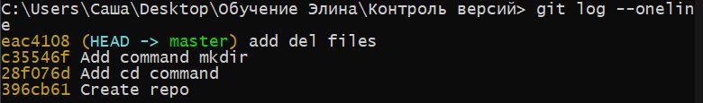

## Инсрукция по работе с Markdown

## Выделение текста

Чтобы выделить текст курсивом, необходимо обрамить его звездочками или знаком нижнего подчеркивания

Чтобы выделить текст полужирным, необходимо обрамить его двойными звездочками или двойным нижнем подчеркиванием

Альтернативные способы выделения текста нужны для совмещения видов выделения. Например одновременно и курсив, и полужирный

## Списки

Чтобы выделить ненумерованный список, используйте звездочку

Чтобы добавить ненумерованные списки необходимо пункты выделить звездочкой

Чтобы добавить нумерованные списки необходимо пункты просто пронумеровать
## Работа с изображениями

Чтобы вставить изображения, следует написать:

## Ссылки

Markdown поддерживает два стиля оформления ссылок:
* Гиперссылка, с немедленным указанием адреса (внутритекстовая)

Подразумевается, что помимо URL-адреса существует еще текст ссылки. Он заключается в квадратные скобки. Для создания внутритекстовой гиперссылки необходимо использовать круглые скобки сразу после закрывающей квадратной. Внутри них необходимо поместить URL-адрес. В них же возможно расположить название, заключенное в кавычки, которое будет отображаться при наведении, но этот пункт не является обязательным.
[пример](http://example.com/ "Необязательная подсказка")

* Гиперссылка, подобная сноске

При создании сносной гиперссылки вместо целевого адреса используется вторая пара квадратных скобок, внутри которых помещается метка, идентификатор ссылки (id).
[id]: http://example.com/ "Необязательная подсказка"

## Работа с таблицами

## Цитаты

<<<<<<< HEAD
Также синтаксис Markdown позволяет создавать вложенные цитаты (цитаты внутри цитат). Для их разметки используются дополнительные уровни знаков цитирования («>»).
=======
Для обозначения цитат в языке Markdown используется знак «больше» («>»). Его можно вставлять как перед каждой строкой цитаты, так и только перед первой строкой параграфа.
>>>>>>> quote

## Заключение